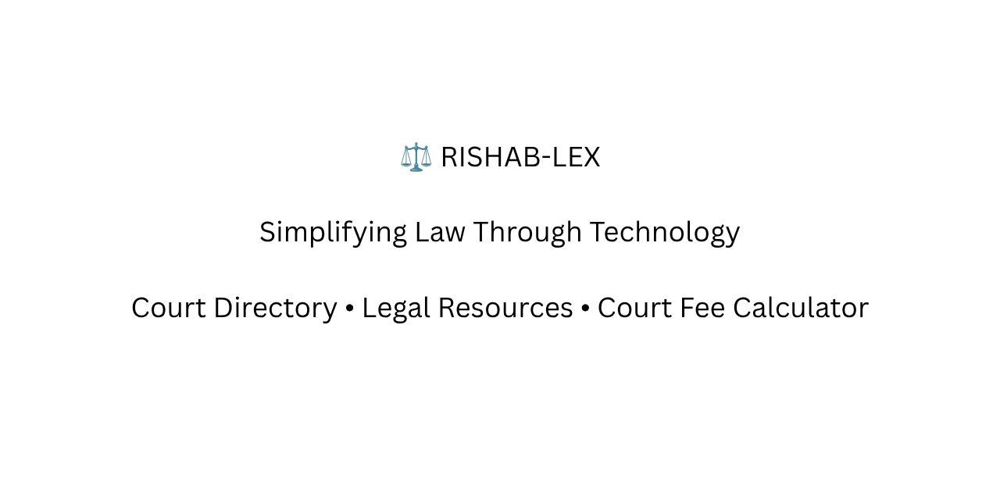

# ⚖️ Rishab-LEX

  

### Simplifying Law Through Technology

A legal resource platform developed by a law student to make legal information more accessible, practical, and easier to understand.

---

## 🚀 Key Features

📍 Vadodara District Court Room Directory

⚖️ Civil Suit Court Fee Calculator

📚 Bare Acts with Simplified Explanations

📖 Important Judgments & Case Summaries

📝 Legal Articles & Student Resources

🏛 NGO & Internship Information

📘 Legal Glossary for Beginners

---

## 🎯 Purpose

Rishab-LEX aims to bridge the gap between legal information and practical accessibility by providing useful tools, simplified legal content, and court-related resources for:

- Law Students
- Advocates
- Interns
- Litigants
- Court Visitors

---

## 🛠 Tech Stack

- HTML5
- Bootstrap 5
- JavaScript
- Responsive Design

---

## 🌟 Featured Tool

### Civil Suit Court Fee Calculator

Instantly calculate court fees based on suit valuation according to the applicable court fee schedule.

Useful for:
- Advocates
- Law Students
- Legal Interns
- Litigants

---

## 📍 Vadodara District Court Directory

One of the flagship features of Rishab-LEX is the Vadodara District Court Room Directory, designed to help visitors quickly locate court rooms and judges without confusion.

---

## 👨‍⚖️ About the Developer

Rishab Kanaujia

Law Student • Former Tech Student

Passionate about combining law and technology to create practical legal tools and resources.

---

## 📬 Contact

📧 Email: rishablex05@gmail.com

📸 Instagram: @lawgically_incorrect

---

## ⚠ Disclaimer

This website is an independent educational initiative. While every effort is made to ensure accuracy, users should verify important legal information through official sources. If you notice any error, feel free to contact me for review and correction.

---

### ⭐ If you find this project useful, consider giving it a star.
